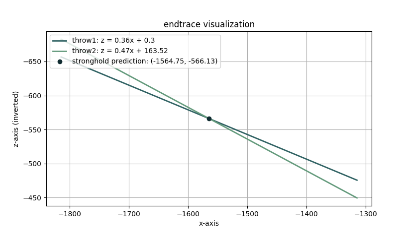

<div align="center">
    <picture>
      <source media="(prefers-color-scheme: light)" srcset="images/endtrace-light.svg">
      <source media="(prefers-color-scheme: dark)" srcset="images/endtrace-dark.svg">
      
    </picture>
</div>

<p align="center">
    A simple tool that locates Minecraft strongholds
</p>

<p align="center">
    
    
    <a href="https://github.com/justmaso/endtrace/blob/main/LICENSE"></a>
</p>

---

## About
A simple tool that locates Minecraft strongholds using data from two Eye of Ender throws. Easily obtain stronghold coordinates and visualize the prediction if desired.


## Installation
Using [`pip`](https://pypi.org/project/pip/):
```
git clone https://github.com/justmaso/endtrace.git
cd endtrace
pip install -r requirements.txt
```

Using [`conda`](https://anaconda.org/anaconda/conda):
```
git clone https://github.com/justmaso/endtrace.git
cd endtrace
conda install --file requirements.txt
```


## Usage
### CLI Options:
```
usage: endtrace [-h] [-g] x1 z1 theta1 x2 z2 theta2

approximates the location of minecraft strongholds

positional arguments:
  x1           the x-coord of your first throw
  z1           the z-coord of your first throw
  theta1       the angle of your first throw (in degrees)
  x2           the x-coord of your second throw
  z2           the z-coord of your second throw
  theta2       the angle of your second throw (in degrees)

options:
  -h, --help   show this help message and exit
  -g, --graph  show a graph of the endtrace stronghold prediction
```

### Gathering Data from Eye of Ender Throws:
1. Open the debug screen by pressing `F3` on your keyboard
2. Throw an Eye of Ender
3. Center your crosshair over the thrown Eye of Ender
4. Gather the necessary data for the prediction to work (i.e., `x`, `z`, `theta`):


## Example
After obtaining the data from both Eye of Ender throws, input it as follows:

```
python endtrace.py -2567.330 -4630 101.5 -1967 -4630 116.5 --graph
predicted stronghold coords:
        (x=-1553.15, y=?, z=-4836.34)
```

The above example produces the following visualization:

